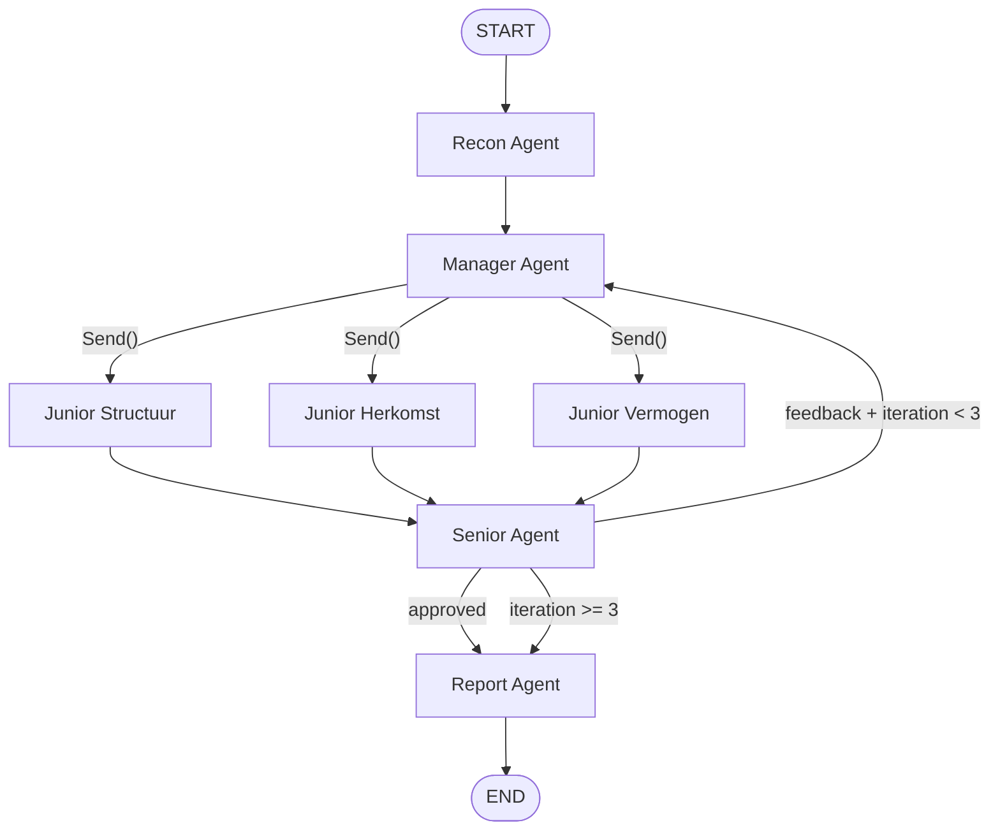

# CDD Multi-Agent Rapportage Applicatie

## Projectstructuur

```
cdd_bot/
├── .env.example              # Alle environment variabelen
├── requirements.txt          # Pinned dependencies
├── README.md                 # Azure setup guide + gebruiksinstructies
├── app.py                    # Streamlit UI (entry point)
├── config.py                 # Env-loading, LLM factory (heavy/light)
├── doc_processor.py          # Azure Document Intelligence wrapper
├── cdd_graph.py              # LangGraph StateGraph definitie + compile
├── agents/
│   ├── __init__.py
│   ├── recon.py              # Recon Agent (heavy)
│   ├── manager.py            # Manager Agent (heavy)
│   ├── juniors.py            # Junior Structuur/Herkomst/Vermogen (light)
│   ├── senior.py             # Senior Agent (heavy)
│   └── report.py             # Report Agent (light)
└── prompts/
    ├── __init__.py
    └── system_prompts.py     # Alle system prompts, incl. Wwft-beleid slot
```

---

## 1. Azure Setup Guide (in `README.md`)

Beknopt stappenplan voor de benodigde Azure-resources:

- **Azure AI Document Intelligence** — Maak een resource aan (S0 tier). Noteer endpoint + key.
- **Azure OpenAI Service** — Maak twee deployments aan via Azure AI Foundry:
  - `HEAVY_DEPLOYMENT`: bijv. `gpt-4o` (voor Recon, Manager, Senior)
  - `LIGHT_DEPLOYMENT`: bijv. `gpt-4o-mini` (voor Juniors, Report)
- Noteer de Azure OpenAI endpoint, API key en API versie.

---

## 2. Environment Template (`.env.example`)

```env
# Azure Document Intelligence
AZURE_DOC_INTEL_ENDPOINT=https://<naam>.cognitiveservices.azure.com/
AZURE_DOC_INTEL_KEY=<key>

# Azure OpenAI
AZURE_OPENAI_ENDPOINT=https://<naam>.openai.azure.com/
AZURE_OPENAI_API_KEY=<key>
AZURE_OPENAI_API_VERSION=2024-12-01-preview

# Model deployments
HEAVY_DEPLOYMENT=gpt-4o
LIGHT_DEPLOYMENT=gpt-4o-mini

# Optioneel
MAX_SENIOR_ITERATIONS=3
```

---

## 3. `config.py` — Settings & LLM Factory

- Laad env-variabelen via `pydantic-settings` (`BaseSettings` met `.env` support).
- Exporteer twee functies: `get_heavy_llm()` en `get_light_llm()` die elk een geconfigureerde `AzureChatOpenAI` instance retourneren uit `langchain-openai`.
- `temperature=0` voor determinisme in het compliance-domein.

```python
from langchain_openai import AzureChatOpenAI

def get_heavy_llm() -> AzureChatOpenAI:
    return AzureChatOpenAI(
        azure_deployment=settings.heavy_deployment,
        azure_endpoint=settings.azure_openai_endpoint,
        api_key=settings.azure_openai_api_key,
        api_version=settings.azure_openai_api_version,
        temperature=0,
    )
```

---

## 4. `doc_processor.py` — Azure Document Intelligence

- Gebruik `azure-ai-documentintelligence` SDK (v1.0.x).
- Functie `process_documents(files: list[UploadedFile]) -> list[dict]`:
  - Roept `begin_analyze_document(model_id="prebuilt-layout", ...)` aan per PDF.
  - Retourneert per document: `{"filename": str, "pages": list[Page], "tables": list[Table], "raw_text": str}`.
  - Tabellen worden gestructureerd naar Markdown-tabellen zodat de LLM ze kan lezen.
- Error handling voor corrupte/onleesbare PDF's.

---

## 5. `cdd_graph.py` — LangGraph State Machine

### State Definitie

```python
class CddState(TypedDict):
    client_type: str                            # "particulier" | "zakelijk"
    toelichting: str                            # Vrije tekst analist
    documents: list[dict]                       # OCR output van doc_processor
    recon_index: str                            # Gestructureerde doc-index (Recon)
    klantprofiel: str                           # Output Junior Structuur
    organogram_mermaid: str                     # Mermaid.js code (zakelijk)
    herkomst_middelen: str                      # Output Junior Herkomst
    hnwi_status: str                            # Output Junior Vermogen
    verklaard_vermogen: str                     # Output Junior Vermogen
    senior_feedback: Annotated[list[str], add]  # Cumulatieve feedback
    senior_approved: bool                       # Gate voor report
    iteration_count: int                        # Loop teller (max 3)
    final_report: str                           # Markdown rapport
    current_agent: str                          # Voor UI status tracking
```

### Graph Topologie




### Kernmechanismen

- **Parallelle Juniors**: De Manager-node retourneert via een conditional edge een `list[Send("junior_*", state)]` om de drie Juniors parallel te lanceren. De `Annotated[list, add]` reducer op `senior_feedback` zorgt dat parallelle writes niet verloren gaan.
- **Feedback Loop**: De Senior zet `senior_approved=False` + vult `senior_feedback` aan. Een conditional edge na Senior routeert:
  - `senior_approved == True` → `report`
  - `iteration_count >= MAX` → `report` (forceer afronden, benoem gaps)
  - Anders → terug naar `manager` (die de Juniors opnieuw aanstuurt met feedback)
- **current_agent**: Elke node-functie zet `current_agent` in de state zodat de UI weet welke agent actief is.

---

## 6. `agents/` — Node Functies

Elke agent-module exporteert een functie `def <agent_name>(state: CddState) -> dict`:


| Agent                | Model | Input                                                          | Output (state keys)                                     |
| -------------------- | ----- | -------------------------------------------------------------- | ------------------------------------------------------- |
| **Recon**            | Heavy | `documents`                                                    | `recon_index`, `current_agent`                          |
| **Manager**          | Heavy | `client_type`, `toelichting`, `recon_index`, `senior_feedback` | `current_agent` (+ routing via Send)                    |
| **Junior Structuur** | Light | `recon_index`, `toelichting`, `senior_feedback`                | `klantprofiel`, `organogram_mermaid`                    |
| **Junior Herkomst**  | Light | `recon_index`, `toelichting`, `senior_feedback`                | `herkomst_middelen`                                     |
| **Junior Vermogen**  | Light | `recon_index`, `toelichting`, `senior_feedback`                | `hnwi_status`, `verklaard_vermogen`                     |
| **Senior**           | Heavy | Alle junior outputs + `recon_index`                            | `senior_approved`, `senior_feedback`, `iteration_count` |
| **Report**           | Light | Alle goedgekeurde outputs                                      | `final_report`                                          |


### System Prompts Strategie (`prompts/system_prompts.py`)

De drie aangeleverde documenten worden als volgt over de agents verdeeld:

**Recon Agent prompt:**

- Rol: "Je bent een document-indexeerder. Je trekt GEEN conclusies. Je mapt uitsluitend de inhoud van elk document."
- Instructie om per document te rapporteren: type document, entiteiten, bedragen, datums, en of het een bewijsstuk is uit Bijlage 1.
- Geen Wwft-beleid nodig — puur data-extractie.

**Manager Agent prompt:**

- Rol: "Je bent de workflow-manager. Op basis van het client_type (particulier/zakelijk) en de recon_index, delegeer je taken."
- Bevat de Bloei vermogen scope (par. 2.3): circa 3.000 klanten, 15% zakelijk, 85% particulier, discretionair vermogensbeheer, portefeuilles van ~EUR 2.000 tot EUR 30M.
- Bevat de risicoverhogende factoren checklist (par. 4.4): PEP, adverse media, HNWI (>EUR 2,5M), complexe structuur (>3 lagen of StAK/Stichting/NV/FGR/NGO), hoog-risico sector, hoog-risico land, vastgoed, US-person, transparantie, fiscaal.
- Bij feedback-iteratie: injecteer de `senior_feedback` als specifieke herinstructie aan de Juniors.

**Junior Structuur prompt:**

- Rol: "Je bouwt het klantprofiel (particulier) of de eigendomsstructuur (zakelijk)."
- Bevat par. 4.2.5 (Inzicht in de structuur): eigendoms- en zeggenschapsstructuur via KvK, organogram indien niet verifieerbaar.
- Bevat par. 4.2.6 (UBO): >25% aandelen/stemrechten/eigendomsbelang = UBO. Pseudo-UBO als uiterste terugvaloptie.
- Bevat par. 4.4.6 (Complexe structuur): >3 verticale lagen excl. NP, of aanwezigheid StAK/Stichting/NV/FGR/NGO. Onacceptabel: offshore, Anglo-Saksische trust, SPF, SPV, bearer shares, nominee shareholder.
- Output voor zakelijk: Mermaid.js code voor organogram.
- Output voor particulier: arbeidsstatus, functie, sector, werkgever.

**Junior Herkomst prompt (KERN — Bijlage 1 volledig ingebouwd):**

- Rol: "Je beoordeelt UITSLUITEND de herkomst van middelen conform Bijlage 1 van het Wwft-beleid."
- Bevat de VOLLEDIGE Bijlage 1 Particulier (10 bronnen: inkomen uit werk, pensioen, verkoop woning, verkoop bedrijf, winstuitkering/dividend, erfenis, schenking, gouden handdruk, winst uit beleggen, inkomen uit eigen onderneming) met per bron de vereiste vragen en ondersteunende documenten.
- Bevat de VOLLEDIGE Bijlage 1 Zakelijk (6 bronnen: inkomen uit eigen onderneming, verkoop bedrijf, winstuitkering/dividend, agio storting, verkoop woning/vastgoed, winst uit beleggen) met vereiste vragen en documenten.
- De agent selecteert de juiste bijlage op basis van `client_type`.
- Bevat par. 4.4.2 (Herkomst van middelen): "Het feit dat gelden afkomstig zijn van een gereguleerde instelling betekent niet noodzakelijkerwijs dat de herkomst aannemelijk is."
- Bevat par. 5.1 (Verscherpt onderzoek herkomst): "De uitgevraagde herkomst moet plausibel en controleerbaar zijn."
- Per geidentificeerde bron: benoem welke documenten aanwezig zijn en welke ONTBREKEN.

**Junior Vermogen prompt:**

- Rol: "Je bepaalt de HNWI-status en het verklaard vermogen voor komend jaar."
- Bevat de HNWI-drempel (par. 4.4.3): vermogen > EUR 2.500.000 = HNWI = risicoverhogende factor.
- Instructie: bereken indicatief totaal vermogen over alle rekeninghouders/UBO's, verdeel over componenten (vastgoed, liquide middelen, beleggingen, pensioen, bedrijfswaarde, etc.).
- Verklaard vermogen komend jaar: baseer op inkomen, verwachte stortingen, bekende mutaties.
- Bij zakelijk: HNWI-status per UBO apart bepalen.

**Senior Agent prompt (KERN — Compliance Officer rol):**

- Rol: "Je bent de Compliance Officer. Je valideert de output van de Junior Agents tegen het Bloei vermogen Wwft-beleid."
- Bevat het VOLLEDIGE hoofdstuk 4.4 (alle risicoverhogende factoren) + hoofdstuk 5 (alle verscherpte onderzoeken) + hoofdstuk 6 (risicoclassificatie: Laag/Medium/Verhoogd/Onacceptabel).
- Bevat Bijlage 2 (Hoog risico landen — volledige lijst incl. AFM, Art 9 AMLD4, FATF gray/black).
- Bevat Bijlage 3 (Hoog risicosectoren — 18 sectoren + onacceptabele activiteiten).
- Validatie-checklist: (1) Klopt de structuur? (2) Zijn alle bronnen herkomst middelen onderbouwd per Bijlage 1? (3) Kloppen de bedragen met de documenten? (4) Is HNWI-status correct bepaald? (5) Zijn er risicoverhogende factoren gemist?
- Output: `approved=True` of `approved=False` + specifieke feedback per Junior over wat ontbreekt of fout is.

**Report Agent prompt:**

- Rol: "Je formatteert de goedgekeurde output naar het vereiste Markdown-sjabloon."
- Bevat het exacte output-sjabloon (particulier vs zakelijk).
- Instructie: "Ontbrekende informatie markeer je als '**ONTBREKEND:** [beschrijving + welk document moet worden opgevraagd]'."

**Anti-hallucinatie guardrails (in ALLE prompts):**

- "Je baseert je UITSLUITEND op de aangeleverde documenten en toelichting."
- "Je verzint GEEN bedragen, namen, datums of feiten."
- "Als informatie ontbreekt, benoem dit expliciet als ONTBREKEND inclusief welk bewijsstuk nog moet worden opgevraagd conform Bijlage 1."
- "Je schrijft in het Nederlands."

---

## 7. `app.py` — Streamlit UI

### Layout

```
┌─────────────────────────────────────┐
│  CDD Rapportage Tool           │
├─────────────────────────────────────┤
│  [Sidebar]                          │
│  ○ Particulier  ○ Zakelijk          │
│  [Toelichting textarea]             │
│  [PDF Upload (multi)]               │
│  [▶ Genereer Rapport]              │
├─────────────────────────────────────┤
│  [st.status: Agent voortgang]       │
│  🔍 Recon agent mapt documenten... │
│  📋 Manager verdeelt taken...       │
│  ⚖️ Senior valideert...            │
├─────────────────────────────────────┤
│  [Tabs: Rapport | Organogram]       │
│  Tab 1: st.text_area (bewerkbaar)   │
│  Tab 2: st.code(mermaid) + preview  │
└─────────────────────────────────────┘
```

### Streaming Mechanisme

Het meest betrouwbare patroon (gezien bekende `StreamlitCallbackHandler` + LangGraph incompatibiliteiten):

1. Draai de graph in een **achtergrond-thread** via `threading.Thread`.
2. Gebruik `graph.stream(input, stream_mode="updates")` (sync) in die thread.
3. Communiceer node-updates via een `queue.Queue` naar de Streamlit main thread.
4. De main thread pollt de queue in een `while`-loop en update `st.status()` containers per node.

Alternatief (als Python 3.11+ beschikbaar): gebruik `asyncio.run(graph.astream(...))` met `stream_mode="updates"` en map elke `{node_name: update}` yield naar een `st.status` update.

### Output

- **Rapport**: Verschijnt in een `st.text_area(value=final_report, height=600)` — bewerkbaar en kopieerbaar.
- **Organogram** (zakelijk): `st.code(organogram_mermaid, language="mermaid")` voor kopiëren, plus `streamlit-mermaid` of `st.components.v1.html()` met de Mermaid CDN voor een visuele preview.
- **Ontbrekende info**: Wordt als rode `st.warning()` blokken getoond boven het rapport.

---

## Belangrijke Ontwerpbeslissingen

- **Sync `graph.stream()` + Queue** in plaats van async: vermijdt de bekende `NoSessionContext` errors bij Streamlit + async LangGraph callbacks.
- `**Send()` API** voor parallelle Juniors: schaalbaarder dan hardcoded edges, en laat de Manager dynamisch beslissen welke juniors nodig zijn.
- `**iteration_count` cap op 3**: voorkomt oneindige feedback loops; na 3 iteraties forceert het systeem een rapport met expliciete gaps.
- `**temperature=0`** op alle LLM-calls: minimaliseert hallucinaties in het financiële domein.
- **Wwft-beleid in prompts**: het beleid wordt als constante string in `system_prompts.py` opgenomen, niet als RAG-retrieval — dit garandeert dat het ALTIJD beschikbaar is en voorkomt retrieval-fouten.

